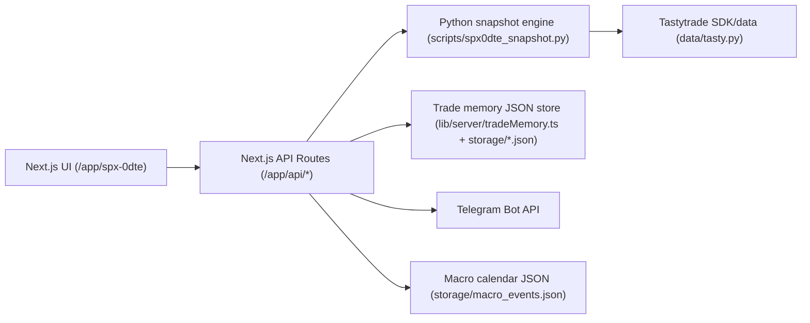

# Final Audit Report

- Generated (UTC): 2026-02-22T13:27:29Z

## Source: SYSTEM_MAP.md

# System Map

## Runtime Architecture


## Inventory
- Frontend entrypoint: `/Users/omardaaboul/options-log/app/spx-0dte/page.tsx`
- Backend HTTP entrypoint: `/Users/omardaaboul/options-log/app/api/spx0dte/route.ts`
- Other API endpoints:
  - `/Users/omardaaboul/options-log/app/api/market/candles/route.ts`
  - `/Users/omardaaboul/options-log/app/api/spx0dte/candidates/route.ts`
  - `/Users/omardaaboul/options-log/app/api/spx0dte/trades/route.ts`
  - `/Users/omardaaboul/options-log/app/api/spx0dte/trades/accept/route.ts`
  - `/Users/omardaaboul/options-log/app/api/spx0dte/trades/reject/route.ts`
  - `/Users/omardaaboul/options-log/app/api/spx0dte/trades/close/route.ts`

## Strategy Modules (Python)
- `/Users/omardaaboul/options-log/strategies/condor.py`
- `/Users/omardaaboul/options-log/strategies/fly.py`
- `/Users/omardaaboul/options-log/strategies/credit_spreads.py`
- `/Users/omardaaboul/options-log/strategies/two_dte_credit.py`
- `/Users/omardaaboul/options-log/strategies/convex.py`
- `/Users/omardaaboul/options-log/strategies/bwb_credit_put.py`
- Exit logic: `/Users/omardaaboul/options-log/strategies/exit.py`
- Filters/signals: `/Users/omardaaboul/options-log/signals/filters.py`

## Data/Broker/Webhook Adapters
- Tasty data/auth: `/Users/omardaaboul/options-log/data/tasty.py`
- Paper order submit scripts:
  - `/Users/omardaaboul/options-log/scripts/paper_primary_order.py`
  - `/Users/omardaaboul/options-log/scripts/paper_two_dte_order.py`
- Telegram notifier logic in API + helper:
  - `/Users/omardaaboul/options-log/alerts/telegram.py`
  - `/Users/omardaaboul/options-log/app/api/spx0dte/route.ts`

## Persistence/Caching
- Candidate/trade memory: `/Users/omardaaboul/options-log/lib/server/tradeMemory.ts`
- Stores under `/Users/omardaaboul/options-log/storage/` (JSON/JSONL files)
- Prisma exists for other app sections: `/Users/omardaaboul/options-log/prisma/schema.prisma`

## External Dependencies
- Tastytrade API/SDK
- Telegram Bot API
- Optional Supabase (airport pages)
- Optional stooq daily candles fallback for chart daily timeframe

## Required Environment Variables
See `/Users/omardaaboul/options-log/.env.example` for the complete runbook.

## Note on FastAPI
A standalone FastAPI+uvicorn backend entrypoint is **not present** in this repo. The backend surface is Next.js API routes with Python subprocess strategy execution.

## Source: OBSERVABILITY.md

# Observability

## What is instrumented
- Structured request logs with correlation IDs for:
  - `/api/spx0dte`
  - `/api/market/candles`
- Response headers:
  - `x-request-id`
  - `x-eval-duration-ms`
- Persistent evaluation snapshots:
  - `/Users/omardaaboul/options-log/storage/spx0dte_snapshot_log.jsonl`

## Debug mode
Set:
```bash
SPX0DTE_DEBUG=true
```
This enables structured JSON logs to stdout for API request lifecycle events.

## Recommended local command
```bash
SPX0DTE_DEBUG=true npm run dev
```

## Current metric coverage
- Endpoint latency: available via `x-eval-duration-ms` and debug logs
- Strategy cycle output: captured in snapshot log + API payload
- Data freshness: exposed in payload fields (`staleData`, `dataContract.feeds.*.ageMs`)

## Known gaps
- No Prometheus/OpenTelemetry exporter yet
- No global frontend telemetry sink (only API-level visibility)
- No distributed tracing across Python subprocess boundaries

## Source: TEST_RESULTS.md

# Test Results

- Timestamp (UTC): 2026-02-22T13:26:52Z

## Lint
```

> options-log@0.1.0 lint
> eslint

```

## Vitest
```

> options-log@0.1.0 test
> vitest run

The CJS build of Vite's Node API is deprecated. See https://vite.dev/guide/troubleshooting.html#vite-cjs-node-api-deprecated for more details.

 RUN  v2.1.9 /Users/omardaaboul/options-log

 ✓ tests/coach-tips.test.ts (7 tests) 3ms
 ✓ tests/spx0dte-ui.test.ts (3 tests) 2ms
 ✓ tests/payoff.test.ts (6 tests) 3ms
 ✓ tests/data-contract.test.ts (4 tests) 4ms
 ✓ tests/trade-memory.test.ts (2 tests) 5ms
 ✓ tests/adaptive-polling.test.ts (5 tests) 3ms

 Test Files  6 passed (6)
      Tests  27 passed (27)
   Start at  14:26:58
   Duration  435ms (transform 191ms, setup 0ms, collect 289ms, tests 19ms, environment 1ms, prepare 458ms)

```

## Next Build
```

> options-log@0.1.0 build
> next build --webpack

▲ Next.js 16.1.3 (webpack)
- Environments: .env

  Creating an optimized production build ...
✓ Compiled successfully in 1594.1ms
  Running TypeScript ...
  Collecting page data using 7 workers ...
  Generating static pages using 7 workers (0/24) ...
  Generating static pages using 7 workers (6/24) 
  Generating static pages using 7 workers (12/24) 
  Generating static pages using 7 workers (18/24) 
✓ Generating static pages using 7 workers (24/24) in 218.1ms
  Finalizing page optimization ...
  Collecting build traces ...

Route (app)
┌ ○ /
├ ○ /_not-found
├ ○ /airport
├ ○ /airport/matrix
├ ○ /airport/people
├ ƒ /airport/people/[id]
├ ƒ /api/market/candles
├ ƒ /api/spx0dte
├ ƒ /api/spx0dte/candidates
├ ƒ /api/spx0dte/trades
├ ƒ /api/spx0dte/trades/accept
├ ƒ /api/spx0dte/trades/close
├ ƒ /api/spx0dte/trades/reject
├ ○ /cashflows
├ ○ /coach
├ ○ /coach/dashboard
├ ○ /coach/rules
├ ○ /coach/setups
├ ○ /coach/trades
├ ƒ /coach/trades/[id]
├ ○ /coach/trades/new
├ ○ /coach/weekly-review
├ ○ /dashboard
├ ○ /import
├ ○ /settings
├ ○ /spx-0dte
├ ○ /spx-0dte/alerts
├ ○ /spx-0dte/analytics
├ ○ /spx-0dte/settings
├ ○ /spx-0dte/trades
└ ○ /trades


○  (Static)   prerendered as static content
ƒ  (Dynamic)  server-rendered on demand

```

## Pytest
```
.................................................                        [100%]
49 passed in 0.67s
```

## Source: SMOKE_RESULTS.md

# Smoke Results

- Base URL: http://127.0.0.1:3100
- Timestamp (UTC): 2026-02-22T13:27:11Z

## Endpoint Checks
- GET /api/spx0dte ✅
- GET /spx-0dte ✅
- GET /api/spx0dte/candidates ✅
- GET /api/spx0dte/trades ✅

## Summary
```
market_source= market-closed
candidates= 5
alerts= 0
candidates_endpoint_ok= True
trades_endpoint_ok= True
```

## Dev Log Tail
```

> options-log@0.1.0 dev
> next dev --port 3100

▲ Next.js 16.1.3 (Turbopack)
- Local:         http://localhost:3100
- Network:       http://192.168.1.19:3100
- Environments: .env

✓ Starting...
✓ Ready in 2.9s
 GET /api/spx0dte 200 in 2.7s (compile: 1763ms, render: 925ms)
 GET /api/spx0dte 200 in 7ms (compile: 1710µs, render: 5ms)
 GET /spx-0dte 200 in 1954ms (compile: 1875ms, render: 79ms)
 GET /api/spx0dte/candidates?limit=3 200 in 277ms (compile: 274ms, render: 3ms)
 GET /api/spx0dte/trades?status=OPEN&limit=3 200 in 215ms (compile: 212ms, render: 2ms)
```

## Source: STRESS_TEST_REPORT.md

# Stress Test Report

- Base URL: http://127.0.0.1:3100
- Users: 50
- Requests per user: 20
- Timestamp (UTC): 2026-02-22T13:27:19Z

## Results
```json
{
  "total": 1000,
  "errors": 0,
  "errorRate": 0,
  "p50": 125,
  "p95": 337,
  "p99": 504,
  "max": 524,
  "min": 0
}
```

## Verdict
- PASS: error rate <= 1%

## Source: FAILURE_MODES.md

# Failure Modes

## Observed failure classes
1. Market closed / no live bars
- Symptom: candidates blocked, chart may have no real candles.
- Handling: explicit blocked reasons + no synthetic trading decisions.

2. Missing Tasty credentials / auth errors
- Symptom: snapshot source not live, stale/inactive data contract feeds.
- Handling: startup health and warnings; no live strategy triggers.

3. Telegram disabled or misconfigured
- Symptom: alerts generated in payload but no outbound message.
- Handling: `SPX0DTE_ENABLE_TELEGRAM` gate + `/api/spx0dte` `telegram_test` action.

4. External provider latency/failure
- Symptom: stale data and degraded decision quality.
- Handling: stale data kill switch and non-ready strategy states.

5. Local dev runtime lock conflicts
- Symptom: next dev lock file / port collisions.
- Handling: restart sequence and lock cleanup.

## Degrade behavior expected
- No crash
- Strategies move to blocked/not-ready
- Explicit reason surfaced in payload/UI

## Source: DEBUG_FIX_LOG.md

# Debug / Fix Log

## 2026-02-22

1. Added reproducible audit harness
- Files: `Makefile`, `scripts/dev.sh`, `scripts/test.sh`, `scripts/smoke_e2e.sh`, `scripts/stress.sh`, `scripts/audit.sh`
- Reason: one-command runbook + repeatable evidence capture
- Verification: scripts execute and write docs artifacts

2. Added API request correlation + latency headers
- Files:
  - `/Users/omardaaboul/options-log/app/api/spx0dte/route.ts`
  - `/Users/omardaaboul/options-log/app/api/market/candles/route.ts`
- Reason: observability requirement (request IDs, endpoint timing, debug logs)
- Verification: lint/build pass; headers available on responses

3. Chart source hardening (prior pass)
- Removed synthetic emergency chart candles and enforced real-source-only charting.
- Added explicit “no real data” behavior when unavailable.

## Source: LIVE_CHECK.md

# Live Connectivity Check

This check validates live market data connectivity only (no order placement).

## Run
```bash
python3 scripts/live_check.py
```

## Latest Run (UTC)
- Timestamp: 2026-02-22T13:48:00Z
- Result: **FAIL in this runtime**
- Reason:
  - `tastytrade` package not importable in current Python runtime
  - Tasty auth env not loaded in this shell

Output snippet:
```json
{
  "env": {
    "tasty_auth_present": false,
    "telegram_configured": false,
    "telegram_enabled": false
  },
  "tt_live_check": {
    "ran": true,
    "ok": false,
    "returncode": 2,
    "output_tail": [
      "FAIL: Unable to import tastytrade SDK: No module named 'tastytrade'"
    ]
  }
}
```

## What it verifies
- Tasty auth env is present
- Telegram env/config state
- DXLink quote/greeks stream receives ongoing updates (`tt_live_check.py`)

## Pass criteria
- `PASS: Live DXLink streaming is healthy.` appears in output

## Safety
- No order API call is made in this script
- Intended for connectivity validation only
