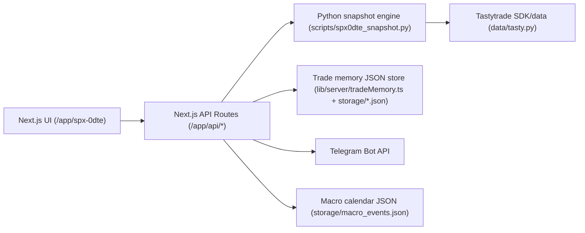

# System Map

## Runtime Architecture

## Inventory
- Frontend entrypoint: `/Users/omardaaboul/options-log/app/spx-0dte/page.tsx`
- Backend HTTP entrypoint: `/Users/omardaaboul/options-log/app/api/spx0dte/route.ts`
- Other API endpoints:
  - `/Users/omardaaboul/options-log/app/api/market/candles/route.ts`
  - `/Users/omardaaboul/options-log/app/api/spx0dte/candidates/route.ts`
  - `/Users/omardaaboul/options-log/app/api/spx0dte/trades/route.ts`
  - `/Users/omardaaboul/options-log/app/api/spx0dte/trades/accept/route.ts`
  - `/Users/omardaaboul/options-log/app/api/spx0dte/trades/reject/route.ts`
  - `/Users/omardaaboul/options-log/app/api/spx0dte/trades/close/route.ts`

## Strategy Modules (Python)
- `/Users/omardaaboul/options-log/strategies/condor.py`
- `/Users/omardaaboul/options-log/strategies/fly.py`
- `/Users/omardaaboul/options-log/strategies/credit_spreads.py`
- `/Users/omardaaboul/options-log/strategies/two_dte_credit.py`
- `/Users/omardaaboul/options-log/strategies/convex.py`
- `/Users/omardaaboul/options-log/strategies/bwb_credit_put.py`
- Exit logic: `/Users/omardaaboul/options-log/strategies/exit.py`
- Filters/signals: `/Users/omardaaboul/options-log/signals/filters.py`

## Data/Broker/Webhook Adapters
- Tasty data/auth: `/Users/omardaaboul/options-log/data/tasty.py`
- Paper order submit scripts:
  - `/Users/omardaaboul/options-log/scripts/paper_primary_order.py`
  - `/Users/omardaaboul/options-log/scripts/paper_two_dte_order.py`
- Telegram notifier logic in API + helper:
  - `/Users/omardaaboul/options-log/alerts/telegram.py`
  - `/Users/omardaaboul/options-log/app/api/spx0dte/route.ts`

## Persistence/Caching
- Candidate/trade memory: `/Users/omardaaboul/options-log/lib/server/tradeMemory.ts`
- Stores under `/Users/omardaaboul/options-log/storage/` (JSON/JSONL files)
- Prisma exists for other app sections: `/Users/omardaaboul/options-log/prisma/schema.prisma`

## External Dependencies
- Tastytrade API/SDK
- Telegram Bot API
- Optional Supabase (airport pages)
- Optional stooq daily candles fallback for chart daily timeframe

## Required Environment Variables
See `/Users/omardaaboul/options-log/.env.example` for the complete runbook.

## Note on FastAPI
A standalone FastAPI+uvicorn backend entrypoint is **not present** in this repo. The backend surface is Next.js API routes with Python subprocess strategy execution.
